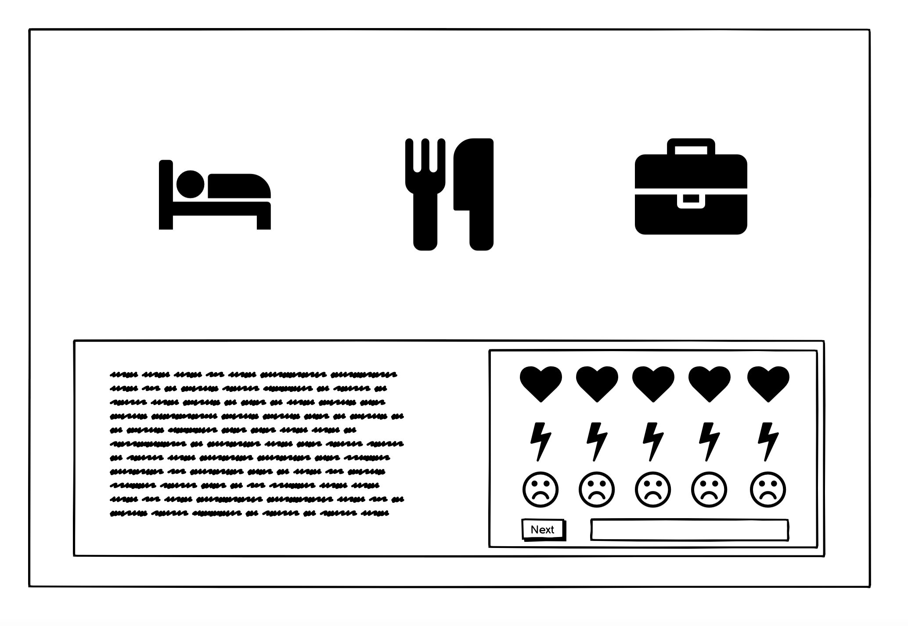

# The Never Ending Coding Adventure: Codehog Day

In this section, you will include one or two paragraphs providing an overview of your project. Essentially, this part is your sales pitch. At this stage, you should have a name for your project so use it! Don’t introduce the project as a Portfolio project for the diploma. In this section, describe what the project hopes to accomplish, who it is intended to target and how it will be useful to the target audience. 

For example; Love Running is a site that hopes to help keep people motivated to meet up for runs on a regular basis in Dublin, Ireland. The site will be targeted toward runners who are looking for a way to socialise and keep themselves fit. Love Running will be useful for runners to see exactly when and where they should be to join the running club.

## Features 

In this section, you should go over the different parts of your project, and describe each in a sentence or so. You will need to explain what value each of the features provides for the user, focusing on who this website is for, what it is that they want to achieve and how your project is the best way to help them achieve these things.

### Existing Features

- __Navigation Bar__

 
 - Featured on all three pages, the full responsive navigation bar includes links to the Logo, Home page, Gallery and Sign Up page and is identical in each page to allow for easy navigation.
  - This section will allow the user to easily navigate from page to page across all devices without having to revert back to the previous page via the ‘back’ button. 

For some/all of your features, you may choose to reference the specific project files that implement them.

In addition, you may also use this section to discuss plans for additional features to be implemented in the future:

### Features Left to Implement

- Another feature idea

## Testing 

In this section, you need to convince the assessor that you have conducted enough testing to legitimately believe that the site works well. Essentially, in this part you will want to go over all of your project’s features and ensure that they all work as intended, with the project providing an easy and straightforward way for the users to achieve their goals.

In addition, you should mention in this section how your project looks and works on different browsers and screen sizes.
You should also mention in this section any interesting bugs or problems you discovered during your testing, even if you haven't addressed them yet.
If this section grows too long, you may want to split it off into a separate file and link to it from here.

### Validator Testing 

- HTML
  - No errors were returned when passing through the official  [W3C validator](#)
- CSS
  - No errors were found when passing through the official [(Jigsaw) validator](#)

### Unfixed Bugs

You will need to mention unfixed bugs and why they were not fixed. This section should include shortcomings of the frameworks or technologies used. Although time can be a big variable to consider, paucity of time and difficulty understanding implementation is not a valid reason to leave bugs unfixed. 

## Deployment

This section should describe the process you went through to deploy the project to a hosting platform (e.g. GitHub) 

- The site was deployed to GitHub pages. The steps to deploy are as follows: 
  - In the GitHub repository, navigate to the Settings tab 
  - From the source section drop-down menu, select the Master Branch
  - Once the master branch has been selected, the page will be automatically refreshed with a detailed ribbon display to indicate the successful deployment. 

The live link can be found here - [The Never Ending Coding Adventure: Codehog Day](https://github.com/andrewdempsey2018/The-Never-Ending-Coding-Adventure-Codehog-Day/index.html)

## The Team

### Andrew
Write something nice here, Andrew. 

### John
Gaming has always been a passion of mine so this hackathon was a must. A retro game will make a proud addition to the portfolio and it was a great experience shaping it with the team. Hope you all enjoy it.

### Yorick
Write something nice here, Yorick. 

### Katherine
I've been gaming since I was about 8.  I had an Acorn Electron. These days I'm a Simmer.  The fastest thing I can type is "testingcheatsenabled true".  This is a Sims joke that probably no one will understand.

### Patrik
Write something nice here, Patrik. 

### Helena
Write something nice here, Helena. 

## Credits 

In this section you need to reference where you got your content, media and extra help from. It is common practice to use code from other repositories and tutorials, however, it is important to be very specific about these sources to avoid plagiarism. 
You can break the credits section up into Content and Media, depending on what you have included in your project. 

- [Text Box - Final Fantasy 7 Style Dialouge box](https://codepen.io/terrancerobb/pen/bnuqe)

- [Sleeping gif](https://wifflegif.com/gifs/136337-pixel-art-sleeping-gif)
- [Pong Poster](https://live.staticflickr.com/3320/3669852343_2c2929e121_b.jpg)
- [Breakout Poster](https://i.ebayimg.com/images/g/NEQAAOSw0YBgAKva/s-l300.jpg)
- [Flappy Bird Poster](https://i.kym-cdn.com/photos/images/original/000/697/154/ada)

### Content 

- The text for the Home page was taken from Wikipedia Article A
- Instructions on how to implement form validation on the Sign Up page was taken from [Specific YouTube Tutorial](https://www.youtube.com/)
- The icons in the footer were taken from [Font Awesome](https://fontawesome.com/)

### Media

- The photos used on the home and sign up page are from This Open Source site
- The images used for the gallery page were taken from this other open source site